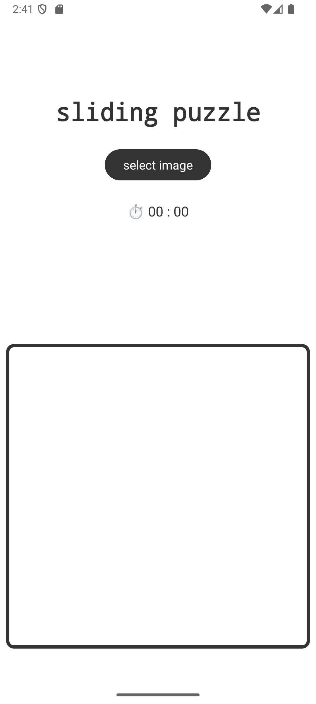
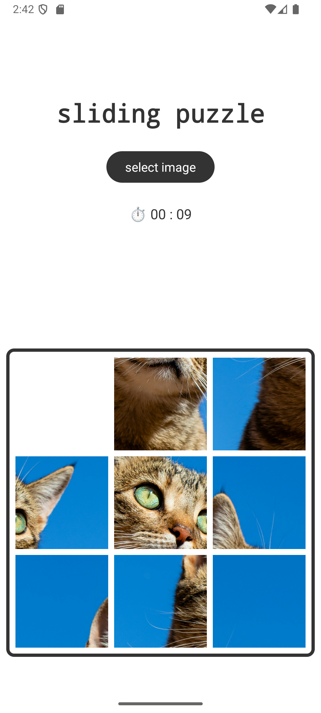
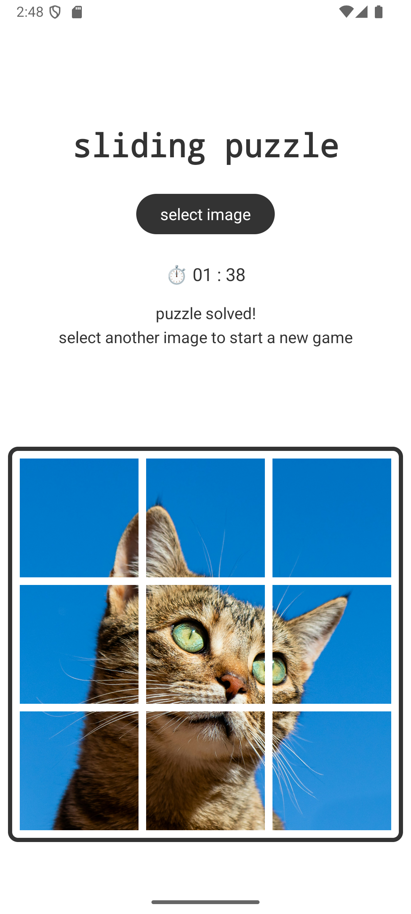

# Sliding puzzle Android application

The image selected by the player is cropped into a square
and then placed on the grid. Puzzle grid size is fixed (currently 3x3). Puzzle pieces can be moved
by clicking on them.

## Technical details

The project uses Kotlin as the main language, MVVM architecture, LiveData for updating the UI.

## To do/Improvements

- make landscape mode more user friendly
- add tests